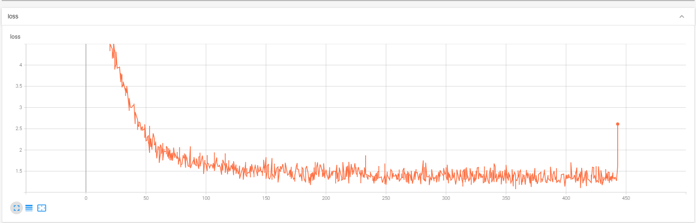
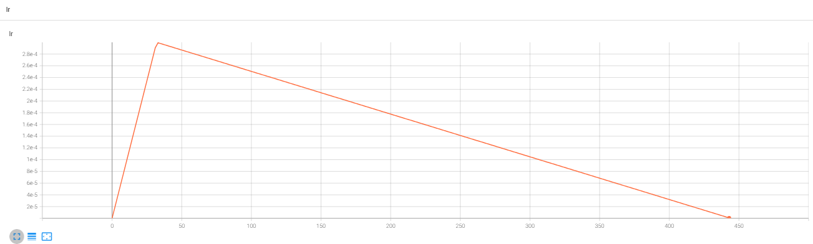
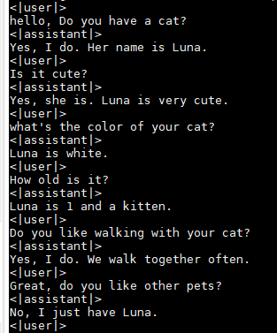
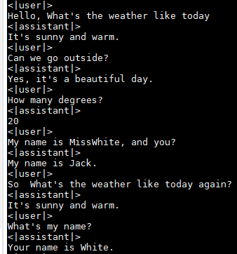

# chatglm3-6b-sft
chatglm3-6b, chatglm-3b微调/LORA/推理/单机多卡/deepspeed/支持多轮对话

## 踩坑(截至20231031)
0.官方prompt, 支持chatml(system), system可以改,但是要注意<|user|>最好放第一位, 如果换成<|assistant|>直接预测、微调会变得很差
```
<|system|>
You are ChatGLM3, a large language model trained by Zhipu.AI. Follow the user's instructions carefully. Respond using markdown.
<|user|>
Hello
<|assistant|>
Hello, I'm ChatGLM3. What can I assist you today?
```
1. torch>=2.0, 否则微调会报很多错误(单纯推理可以用低版本);
2. tokenizer.encode输出为 [gMASK, sop, 真实文本token]
```
    "[MASK]": 64789,
    "[gMASK]": 64790,
    "[sMASK]": 64791,
    "sop": 64792,
    "eop": 64793,
    "<|system|>": 64794,
    "<|user|>": 64795,
    "<|assistant|>": 64796,
    "<|observation|>": 64797
```
3. modeling_chatglm.py自带get_masks()的代码full_attention_mask -= padding_mask.unsqueeze(-1) - 1改为
                full_attention_mask = full_attention_mask.long() - padding_mask.unsqueeze(-1).long() - 1
4. 不支持gradient_checkpointing, 修复的话需要modeling_chatglm.py新增get_input_embeddings, set_input_embeddings;
5. 官方prompt, chatglm3支持工具调用
```
<|system|>
Answer the following questions as best as you can. You have access to the following tools:
[
    {
        "name": "get_current_weather",
        "description": "Get the current weather in a given location",
        "parameters": {
            "type": "object",
            "properties": {
                "location": {
                    "type": "string",
                    "description": "The city and state, e.g. San Francisco, CA",
                },
                "unit": {"type": "string"},
            },
            "required": ["location"],
        },
    }
]
<|user|>
今天北京的天气怎么样？
<|assistant|>
好的，让我们来查看今天的天气
<|assistant|>get_current_weather
'''python
tool_call(location="beijing", unit="celsius")
'''
<|observation|>
{"temperature": 22}
<|assistant|>
根据查询结果，今天北京的气温为 22 摄氏度。
```
6. 官方prompt构建chat实现代码:
```python
def build_chat_input(self, query, history=None, role="user"):
    if history is None:
        history = []
    input_ids = []
    for item in history:
        content = item["content"]
        if item["role"] == "system" and "tools" in item:
            content = content + "\n" + json.dumps(item["tools"], indent=4, ensure_ascii=False)
        input_ids.extend(self.build_single_message(item["role"], item.get("metadata", ""), content))
    input_ids.extend(self.build_single_message(role, "", query))
    input_ids.extend([self.get_command("<|assistant|>")])
    return self.batch_encode_plus([input_ids], return_tensors="pt", is_split_into_words=True)
```


## 环境配置
```shell
transformers==4.27.1
torch>=2.0
sentencepiece
cpm_kernels
mdtex2html
accelerate
protobuf
gradio
```

## 微调样例
```shell
地址: chatglm3_6b/ft_chatglm3

配置: chatglm3_6b/ft_chatglm3/config.py
训练: python train.py
接口: python post_api.py
多卡: nohup deepspeed --num_gpus=2 train_deepspeed.py --deepspeed ds.json  > tc.train_deepspeed.py.log 2>&1 &

```

## 实验日志
### 微调日志(metalwoz数据集, 英文主题多轮对话)





### 推理样例(LoRA, R=8)
回答得比较短了, 也确实遵循了主题






## 参考/感谢
 - [https://github.com/THUDM/ChatGLM3-6B](https://github.com/THUDM/ChatGLM3-6B)
 - [https://github.com/THUDM/ChatGLM2-6B](https://github.com/THUDM/ChatGLM2-6B)
 - [https://github.com/THUDM/ChatGLM-6B](https://github.com/THUDM/ChatGLM-6B)
 - [https://github.com/huggingface/peft](https://github.com/huggingface/peft)
 - [https://github.com/Instruction-Tuning-with-GPT-4/GPT-4-LLM](https://github.com/Instruction-Tuning-with-GPT-4/GPT-4-LLM)
 - [math23k](https://aclanthology.org/D17-1088)
 - [metalwoz](https://www.microsoft.com/en-us/research/project/metalwoz/)

## 免责申明
本项目相关资源仅供学术研究之用，使用涉及第三方代码的部分时，请严格遵循相应的开源协议。模型生成的内容受模型计算、随机性和量化精度损失等因素影响，本项目不对其准确性作出保证。对于模型输出的任何内容，本项目不承担任何法律责任，亦不对因使用相关资源和输出结果而可能产生的任何损失承担责任。
 - 大模型权重的详细协议见[THUDM/chatglm3-6b](https://github.com/THUDM/ChatGLM3-6B)


